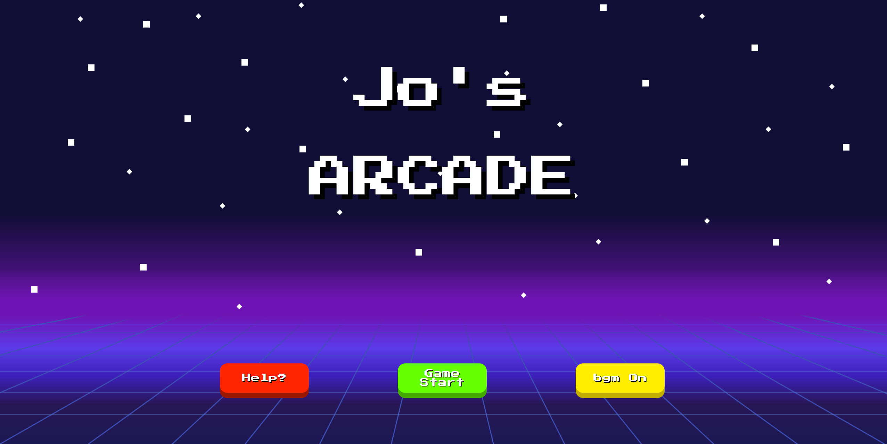
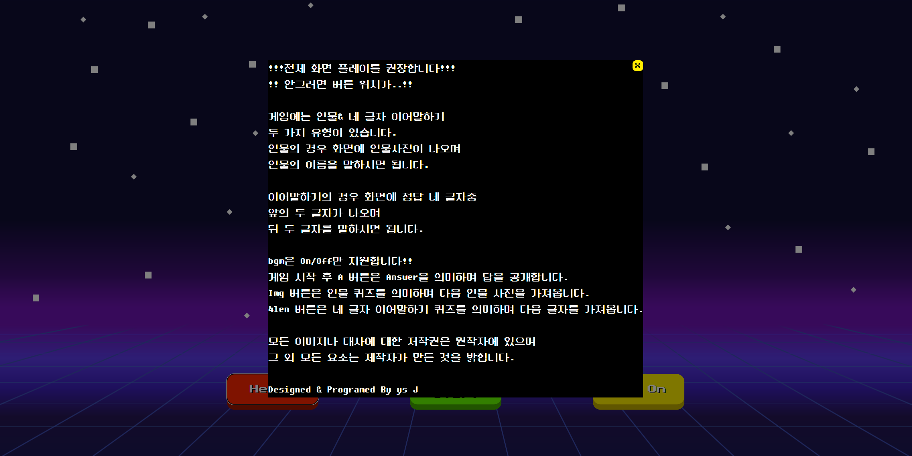
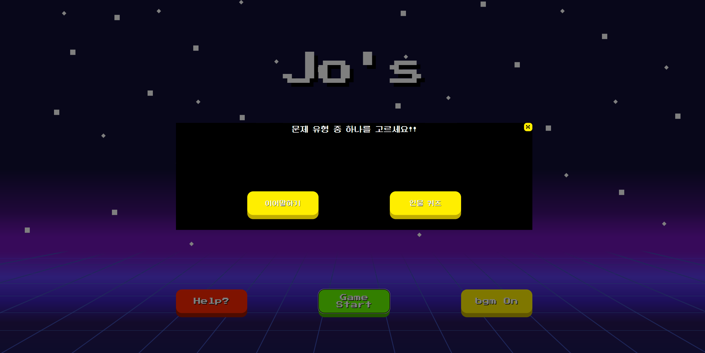
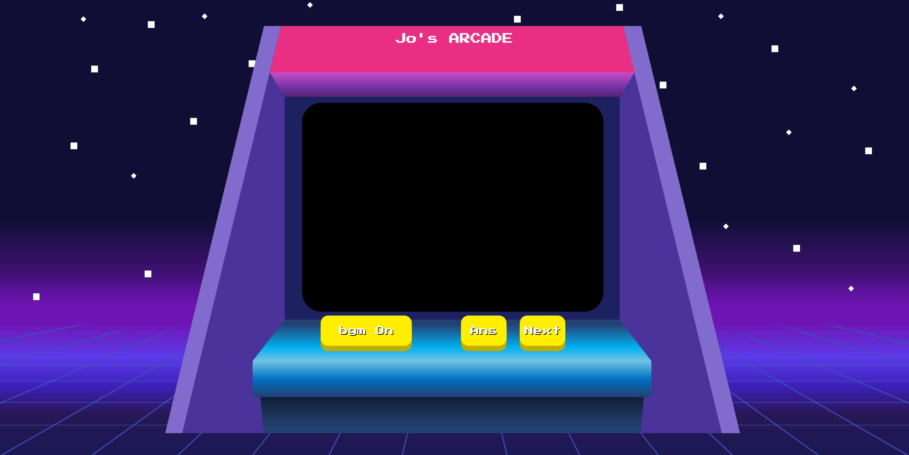
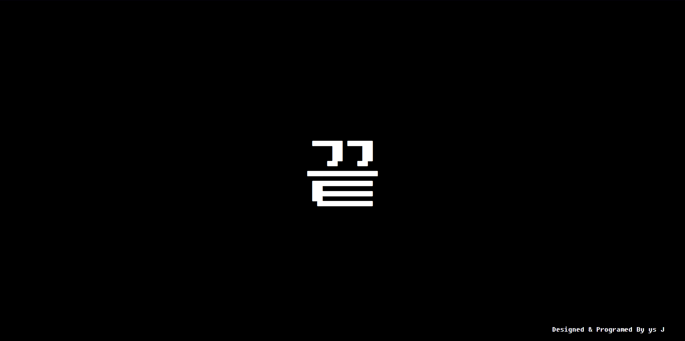
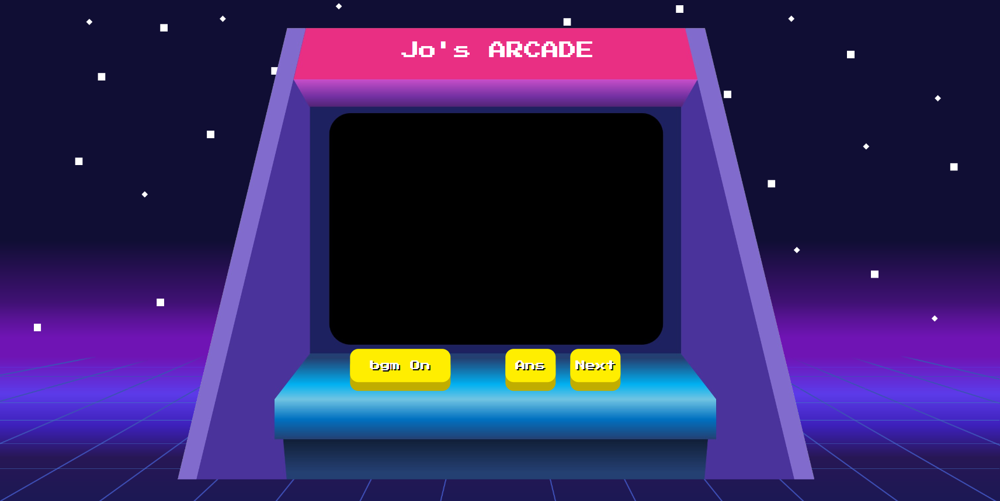
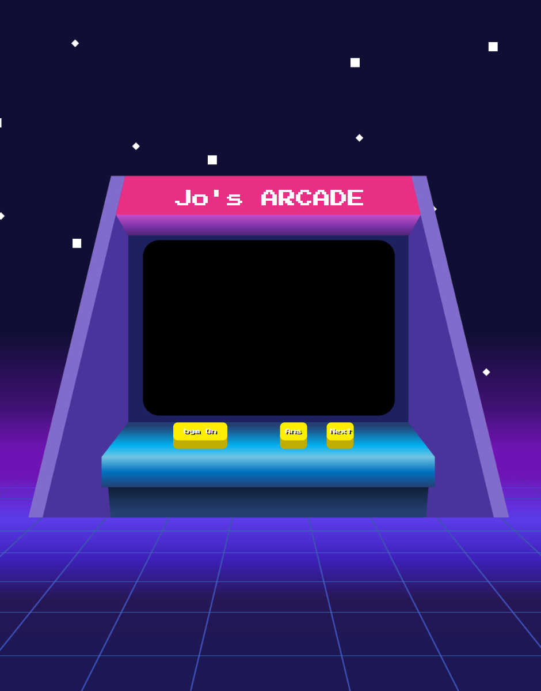

<h1> 🎮 Joe's Arcade 🎮 </h1>

<h3> 🕹️ Joe's Arcade는 모 프로그램의 컨텐츠에 착안하여 만든 웹 게임이며, 
인물 퀴즈, 네글자 이어말하기가 있습니다.</h3>

 

 

## 🛠️ Stacks

 

 

 

## ✨ 페이지 구성

| 1. 메인 페이지           |
|---------------------|
|  |

| 2-1. 도움말 팝업               | 2-2. 문제 유형 선택 팝업       |
|---|---|
|    |  |

| 3. 인 게임 화면|
|---|
|  |

| 4. 게임 종료 팝업 |
|-------------------------|
|  |

 

## ✨ 기능 시연 영상

## ✨ 구현 내용
- react, spring boot 활용한 프론트, 백엔드 개발
- 반응형 웹 구현
- ec2 내 로컬 mysql, 로컬 이미지 저장소 사용 
- ec2 서버 배포

## ✨ 주요 기능
### 1. 반응형 웹 구현

>window Height, window width를 사용해 직접 반응형 웹을 구현했습니다.

| 가로로 길때                  | 새로로 길때                |
|-------------------------|-----------------------|
|  |  |

### 2. 이미지 업로드 시 로컬 이미지 저장소 사용

인물 맞추기용 이미지 업로드 시 서버의 로컬 저장소에 저장되게 했습니다.
> 이미지 저장 비용과 s3 구축 및 운용 비용을 비교하여 로컬 저장소에 이미지를 저장하게 했습니다.

### 3. 문제 무작위 출제

문제를 요청할 때 문제를 무작위로 출제하도록 하였습니다.
> 문제 요청 시 여태 받았던 문제의 id들을 request 파라미터로 넘겨  
> 해당 id 들을 제외한 나머지 중에 무작위로 문제를 출제하게 했습니다.

## ✨ 후기

react를 사용한 프론트 개발을 처음 해 보면서 프론트 개발자의 관점으로 
눈에 보이는 것과 관련한 사용자 경험을 생각해 볼 수 있었습니다. 
ec2 로컬 이미지 저장소, 로컬 mysql의 비용과 rds, s3 비용을 비교하여  
서버 비용을 줄이는 고민을 해 봤습니다.